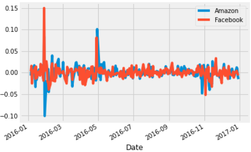

# Budi-Portfolio

# [Project 1: Diabetes Classification](https://github.com/PutihPutih/DiabetesClassification/blob/main/Untitled.ipynb) 
- Data: A dataset of health information for 70,692 patients, including age, sex, BMI, blood pressure, cholesterol levels, smoking habits, and more. The target variable is a binary indicator for the presence of diabetes.
- Exploratory Data Analysis: Conducted exploratory data analysis to gain insights into the distribution of the data and identify any potential issues or outliers. Explored the relationships between the features and the target variable using various data visualization techniques.
- Feature Engineering: Used feature engineering techniques to prepare the data for modeling. This included scaling the continuous features, encoding the categorical features, and selecting the most important features using mutual information score and correlation analysis.
- Model Selection: Evaluated several machine learning algorithms including logistic regression, XGBoost, and random forest, using cross-validation techniques to avoid overfitting. Chose the best-performing algorithm based on the evaluation metrics, including precision, recall, and F1-score.
- Model Evaluation: Evaluated the final model using a holdout dataset to assess its performance on unseen data. Generated a classification report and confusion matrix to understand the model's strengths and weaknesses.
- Results: Achieved an F1-score of 0.76 on the holdout dataset, indicating strong performance in predicting the presence of diabetes. The XGBoost model was the best-performing model in terms of both accuracy and interpretability.

  

# [Project 2: Data Science Risk and Returns_ The Sharpe Ratio](https://github.com/PutihPutih/Risk-and-Returns_-The-Sharpe-Ratio/blob/main/notebook.ipynb) 
- Use pandas to calculate and compare profitability and risk of different investments using the Sharpe Ratio.

  

# [Project 3: The Hottest Topics in Machine Learning](https://github.com/PutihPutih/The-Hottest-Topics-in-Machine-Learning/blob/main/notebook.ipynb) 
- Imported a papers.csv sized of 200+MB with LFS Git
- Used a Term Frequency to gain insight which are the popular searched
- Used RegEx to preprocess the text

  

# [Project 4: SQL Data Exploration](https://github.com/PutihPutih/SQL_Covids/blob/main/CovidQueries.sql) 
- Implemented Joins between two tables
- Implemented an aggregated functions (MAX, ROUND, SUM, etc)
- Implemented common table expressions (CTEs)
# Data used from --> https://ourworldindata.org/covid-deaths

# [Project 5: Netflix_Dashboard](https://public.tableau.com/app/profile/budiono.guntoro/viz/NetflixAnalysis_16802438483920/Dashboard1?publish=yes)
- Geographic analysis on which most country contributed
- Trend analysis on Genre Watched, Shows added, and rating

# [Project 6: Bikestore Dashboard](https://public.tableau.com/app/profile/budiono.guntoro/viz/BookStoreDashboard/Dashboard1?publish=yes)
- Utilized filters for every insight
- Geographic visualization for different state
- Statistical modeling

  

# [Project 6: Covid Dashboard](https://public.tableau.com/shared/RZNSWPKD4?:display_count=n&:origin=viz_share_link)

  

